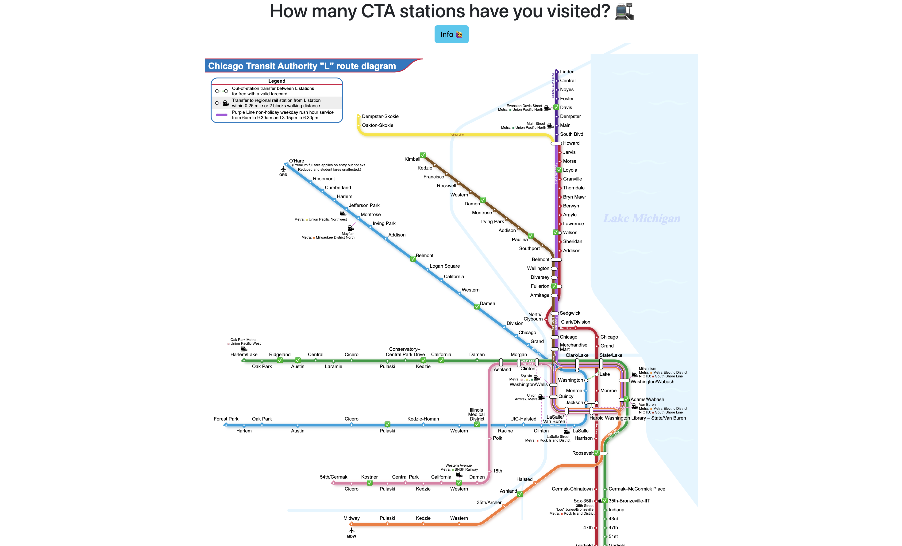
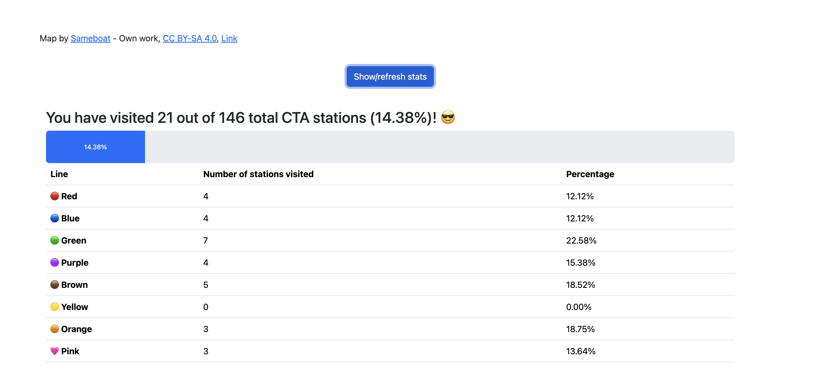

# cta-stats

A simple project allowing users to select CTA stations they've visited on an SVG version of the CTA train system map, and displays visited station statistics.

Extremely simple – uses Bootstrap for styling but is otherwise very vanilla JavaScript.

